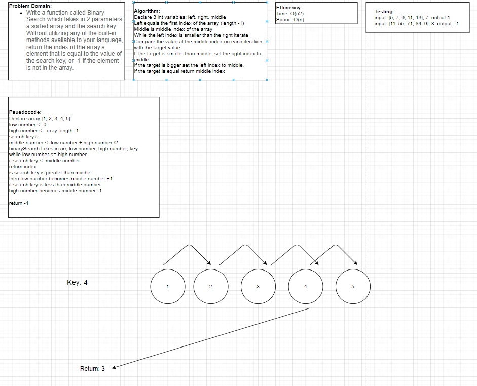

# LAB 02 Arrays, for loops, testing
## Feature Tasks

### ROLLING DICE
### Write a method called roll that accepts an integer n and rolls a six-sided dice n times. The method should return an array containing the values of the rolls.

### CONTAINS DUPLICATES
### Write a method called containsDuplicates that returns true or false depending on whether the array contains duplicate values.

### CALCULATING AVERAGES
### Write a method that accepts an array of integers and calculates and returns the average of all the values in the array.

# Code Challenge 03
## Feature Tasks
### Write a function called BinarySearch which takes in 2 parameters: a sorted array and the search key. Without utilizing any of the built-in methods available to your language, return the index of the array’s element that is equal to the value of the search key, or -1 if the element is not in the array.

## WhiteBoard only Exercise

[Lab3.png]
